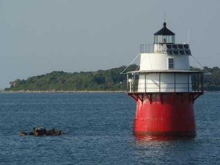
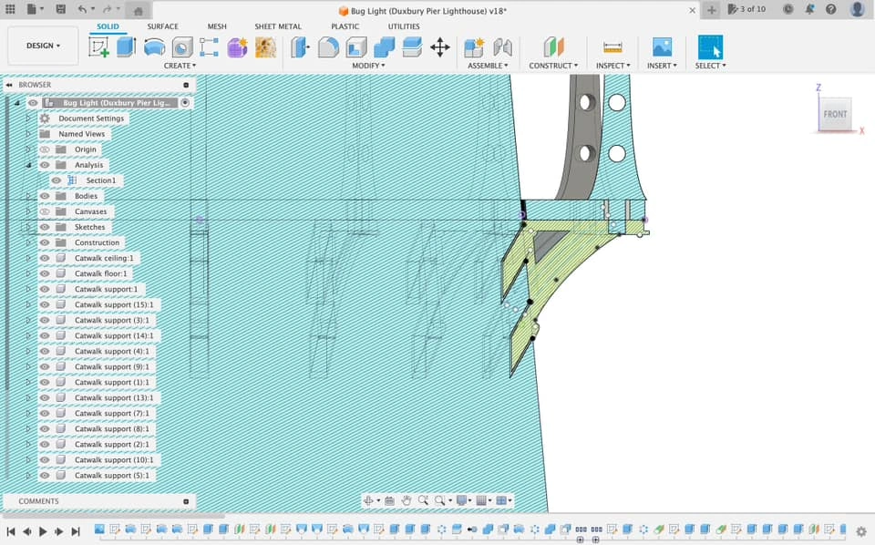

*I wrote this post in 2026 but completed the project in 2023. These are my recollections.*

Duxbury Pier Lighthouse ("Bug Light", known by the locals) is the United States' first “spark plug”-type design. Established in 1871, it's been lighting Plymouth Harbor for a century and a half. My dad has nostalgic memories of swimming around the lighthouse as a boy, so I decided to give him a special birthday gift.

## Modeling

For this project, I used Fusion 360 to model everything. I mostly eyeballed the dimensions by relying on reference images from Google Image Search.

This model doesn't need glue or supports. All structures are supported by gravity. I don't have a special multi-head printer, so I varied the colors by pausing the print and switching the filiment.

Read more about this unique lighthouse at https://buglight.org !
