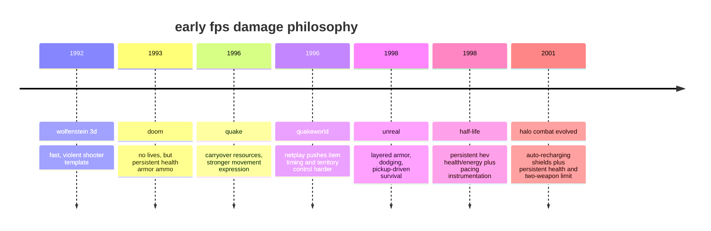

# early fps damage philosophy

## executive summary

from the early 1990s through the early 2000s, the dominant fps damage model was not just “you have health.” it was a whole worldview: damage, armor, ammo, map layout, and movement formed a single economy of cumulative risk. doom, quake, unreal, and entity["video_game","half-life","1998 shooter"] all made hits *stick* unless the player actively earned relief through pickups, safer routing, better aim, better movement, or better pacing. doom even removed lives specifically to reduce frustration, but it *did not* remove persistent health loss; that consequence remained central to tension and learning. citeturn34view0turn27search1turn32view1turn32view2turn33view0turn31view0

halo: combat evolved did **not** simply replace old-school health with modern regeneration. its actual model was hybrid: health remained persistent, but shields auto-recharged when you stopped taking damage, and the game restricted you to two carried weapons at a time. that combination shifted the unit of drama from “survive the whole level with what you have left” to “win this fight, reset, then take the next fight.” bungie’s own design materials framed halo combat in terms of clear battle lines, readable/intelligible enemies, short tactical scopes, consistent challenge, and discouraging boring tactics while rewarding experimentation. citeturn32view3turn41view1turn40view0turn35view0

that is why halo-style shields often feel worse when bolted onto quake. the problem is not that regenerating shields are inherently bad; it is that quake’s weapons, maps, movement, and item economy assume *persistent consequence*. if damage becomes partly reversible for free, then chip damage matters less, health and armor pickups matter less, route control matters less, and the game drifts from continuous crisis toward peek-reset rhythms. in halo, that rhythm is the point. in quake, it can feel like the system has been quietly hollowed out. citeturn32view1turn40view0turn14search4turn14search6turn11search0turn11search1

## historical timeline

the broad arc is pretty clean. wolfenstein 3d established the fast, violent template; doom removed lives but kept damage persistent; quake fused persistent resources to higher movement expression and, via quakeworld, to internet-era item control; unreal elaborated the same pickup economy with richer armor/suit variation and dodging; half-life kept persistent health/hev energy but pushed harder on pacing, player acknowledgment, and scripted density; halo combat evolved then introduced the most influential hybrid alternative, smoothing short-term failure with recharging shields while preserving some long-term stake through non-regenerating health. citeturn27search7turn34view0turn27search1turn32view1turn28search21turn32view2turn31view0turn32view3turn41view1



the timeline hides an important subtlety: halo’s “regeneration” was originally a compromise, not a total philosophical break. the recharging shield softened controller-era execution costs and made short recovery windows legible, but health still had to be restored by pickups. in other words, the first big console shield model did **not** fully trust regeneration either; it layered a renewable outer buffer over a finite inner life pool. that hybrid design is one reason halo ce often feels tenser than the fully shield-centric memory people project backward onto it. citeturn32view3

## design goals and developer intent

### id

for entity["people","john carmack","game programmer"], early shooter design was explicitly driven from technology toward play. in a contemporaneous interview summary, he said id “worked from the technology towards the game” and saw the wolfenstein style of play as “the right thing.” that stance helps explain why doom and quake privileged movement, weapon feel, and combat immediacy over elaborate authored narrative. meanwhile, entity["people","john romero","game designer"] later explained that doom removed lives because doing so helped players get through the game “without becoming too frustrated,” while also describing how doom’s maps evolved beyond wolfenstein’s square-block layouts into more varied spaces. the key point is that doom reduced *one* kind of punishment while preserving another: persistent damage still mattered. citeturn27search2turn27search1turn27search0

the doom manual makes the philosophy practical rather than theoretical. you begin with 100% health, armor is a temporary buffer, death sends you back to the start of the level with just the pistol, and the game repeatedly urges saving because death really does cost progress and resources. that is cumulative jeopardy, plain and simple. it is not “hardcore” for machismo points; it is the engine that makes every pickup, secret, and flanking move feel valuable. citeturn34view0

### valve

entity["people","ken birdwell","game designer"]’s 1999 postmortem on valve’s process is one of the best primary design documents in the genre. the first version of half-life, he says, was scrapped because “the game wasn’t any fun.” the redesign centered on “experiential density,” meaning the player should not wait too long for the next meaningful stimulus, plus “player acknowledgment,” meaning the world should respond to what the player does. most relevant here, valve wanted players to “always blame themselves for failure,” which required telegraphing danger and preserving the sense that survival could have gone differently. later in development the team instrumented playtests, recording player position, health, weapons, saves, deaths, and time; they then used that data to locate boring sections, too-hard sections, too-easy sections, and “where they were likely to die” so they could place “goodies” more intelligently. that is persistent-health tuning as pacing science, not mere tradition. citeturn31view0

the half-life manual aligns with that. the hev suit tracks both health and suit energy, scientists and guards can improve your health, batteries recharge the suit, and the hazard course exists specifically to train maneuver, object use, and weapon handling before the real campaign starts. half-life did not reject attrition; it domesticated it inside better onboarding, better world acknowledgment, and more continuous pacing. citeturn33view0turn32view4

### bungie

entity["people","jason jones","bungie designer"] was unusually explicit about the studio’s prior lessons. in a 2001 bungie interview he said entity["video_game","pathways into darkness","1993 fps"] was “a lesson in how not to balance the difficulty of a video game,” and that entity["video_game","myth: the fallen lords","1997 tactics game"] taught the importance of showing players not only how to play, but “how to have fun playing the game.” that is a huge tell: halo’s shields were not just a survivability tweak. they were part of a broader attempt to make the *fun path* easier to read and easier to recover back into. citeturn35view0

bungie’s 2002 gdc talk by entity["people","jaime griesemer","halo designer"] and entity["people","chris butcher","halo engineer"] is even more revealing. it splits design responsibility into a “3 minute scope” and code responsibility into a “30 second scope,” then states halo’s ai/combat goals as “intelligible,” “interactive,” and “unpredictable.” the slides also say tougher enemies were perceived as smarter in playtests, that the implementation aimed for “consistent challenge,” and that level design should use “negative reinforcement” to “discourage boring tactics” and “reward experimentation.” this is not the philosophy of pure attrition. it is the philosophy of short, readable combat stories with recoverable errors and visible intent. citeturn40view0

bungie’s halo development diaries from 2001 fit the same picture. griesemer described training players “without boring them to death,” using level layouts that naturally encouraged flanking and retreat, and using scripting and communication systems to make the game world feel alive enough that players could “forget you’re playing a game.” the 2008 archive entry for “the illusion of intelligence” later framed the whole talk as an investigation of the design/code intersection in halo combat behavior. citeturn11search0turn11search1turn37view0turn39search17

### epic

entity["people","cliff bleszinski","unreal designer"] later described unreal as deliberately “counter-programmed” against quake’s darker mood: brighter colors, sky castles, cleaner spectacle. but mechanically, unreal still lived inside the classic pickup-attrition family. its manual emphasizes health fruit, superhealth, multiple armor types that weaken as they absorb damage, and movement options like dodging. so epic was counter-programming *aesthetics and atmosphere* more than rejecting the persistent-resource logic of late-1990s fps design. citeturn17search0turn32view2

## case studies and mechanic comparisons

the table below is a synthesis from manuals, interviews, postmortems, and presentation slides. the rightmost column points to the primary evidence behind the row; the “philosophical center” column is my design inference from those mechanics and statements.

| game | health model | replenishment logic | dominant pressure | philosophical center | basis |
|---|---|---|---|---|---|
| doom | persistent health + armor + ammo; no lives | pickups only; death restarts level with pistol/resources reset | every hit creates future debt across the level | survival is a running balance sheet; tension comes from accumulation | citeturn34view0turn27search1 |
| quake | persistent health + armor + ammo, with some cross-level carryover and health clamping between levels | pickups only; item timing matters in both campaign and multiplayer | movement, territory, and denial convert into survivability | damage is territorial and cumulative; chip pressure has real meaning | citeturn32view1turn28search21 |
| unreal | persistent health with superhealth, armor types, protective suits | pickups only; some healing fruit regrows in multiplayer | exploration plus combat attrition, with higher mobility/dodging | traversal and loot ecology stay fused to combat outcomes | citeturn32view2turn17search0 |
| half-life | persistent health + persistent hev energy + ammo | stations, batteries, npc heals, pickups | curated pacing and telegraphed danger inside continuous narrative flow | failure should feel owned by the player, and pacing should be tuned around that | citeturn33view0turn31view0 |
| halo ce | persistent health + auto-recharging shields + two-weapon limit | shields recharge automatically; health still requires pickups | fight-level read/recover/re-engage loops, usually around cover and battle lines | the core unit of fun is the readable “combat story,” not pure long-horizon debt | citeturn32view3turn41view1turn40view0 |

the crucial divide is not “old games had health packs, halo had regen.” that meme is too coarse and, frankly, midwit. the real divide is between *cumulative* and *local-reset* consequence. doom, quake, unreal, and half-life mostly ask: “what must this player carry forward from the last room?” halo ce more often asks: “what happened in the last twenty to forty seconds, and can the player re-enter the next beat in a comprehensible state?” both can be excellent. they just optimize different pleasures. citeturn34view0turn32view1turn32view2turn31view0turn32view3turn40view0

a second difference is spatial. in the classic item-economy shooters, health and armor are reasons to *move*. they lure the player into danger, reward map knowledge, and make route choice a strategic skill expression. in halo ce, because shields renew, movement is less often about scavenging one more margin of life and more often about finding the right angle, the right weapon pairing, or the right recovery pocket between bursts. halo still uses pickups, but the recharging outer layer fundamentally lowers the urgency of the pickup network. citeturn32view1turn32view2turn32view3turn41view1

## academic lenses on death, flow, and fun

the most useful academic frame here is not realism; it is flow, competence, and the emotional function of failure. entity["people","mihaly csikszentmihalyi","flow theorist"]’s flow model, later adapted for games by entity["people","jenova chen","game designer"] and by entity["people","penelope sweetser","researcher"] with entity["people","peta wyeth","researcher"], emphasizes balanced challenge, clear goals, direct feedback, concentration, and control. separately, entity["people","richard ryan","psychologist"], entity["people","c. scott rigby","psychologist"], and entity["people","andrew przybylski","psychologist"] found that autonomy, competence, and relatedness predict game enjoyment. old-school persistent-health systems and halo-style shield systems both can satisfy these criteria, but they do so through different challenge windows and different kinds of competence. citeturn21search4turn21search8turn22search4turn22search16turn22search2

on failure itself, entity["people","jesper juul","game scholar"]’s work is still the load-bearing citation: games are pleasurable partly because they make failure meaningful, even though failure is affectively unpleasant. newer work on respawn consequences similarly finds that death penalties change mastery, challenge, autonomy, curiosity, and immersion. another line of research argues that some frustration is not a design bug but a condition of interesting play. there is even evidence that the most positive players are often not the players who never fail, but the ones who fail some and then complete the game. so the question is not whether to reduce pain; it is what *kind* of pain sustains engagement instead of flattening it. citeturn21search1turn21search5turn21search18turn21search3turn21search21turn21search6turn21search7

that distinction maps well onto fps damage models. persistent health externalizes challenge over a longer horizon: every hit now burdens later decisions, so competence includes forecasting, routing, and emotional composure under attrition. regenerating shields compress challenge into tighter loops: competence shifts toward reading bursts, using cover, and timing re-engagement. neither is automatically more “fun,” but they are not equivalent in the kind of mastery they ask for. the nearest empirical work i found is *adjacent* rather than direct: studies on respawn penalties and a pilot study on health-bar representation, not a clean peer-reviewed a/b comparison of doom/quake-style attrition against halo-style recharging shields in commercial fps combat. citeturn21search18turn23search1

## design discourse after release

post-release design discourse mostly reinforces the same split. later bungie material by griesemer is especially useful because it retrospectively names principles that were already present in halo’s original design. his gdc talk on the halo 3 sniper rifle argues that good balance comes from clearly defined roles, anticipation rather than noisy guesswork, longevity rather than abstract fairness, and resisting dominant strategies that make the game predictable. he also says players do not engage with games statistically; they experience them personally, and balancing should preserve that lived texture rather than just fix metrics. that is extraordinarily relevant to health-system debates, because regen systems often look elegant in abstract graphs while quietly changing the lived shape of danger. citeturn12search0turn14search2turn14search3turn14search4turn14search5turn14search7

his separate writing on enemy design is also a clean bridge back to halo ce. he argues that good enemies should force the player to react, preferably by making them move, reprioritize, or stretch tactically, and that the enemy should challenge the player’s default tactic without becoming a mere bullet sponge. that is basically the halo combat thesis in miniature: use readable pressure to create improvisation, not just raw numerical punishment. shields fit that because they make temporary retreat and re-engagement a readable, repeatable response. citeturn13search3turn14search6

outside the studios, the community/design conversation keeps rediscovering the same fault line. game developer’s 2011 “regenerating health vs. items” debate treated the choice as a pacing and integration question, not a universal ranking. more polemical blog criticism, like critpoints, framed regeneration as reducing tension by erasing the long tail of previous mistakes. forum discourse on truegaming likewise tends to describe health packs as producing sustained tension and regenerative systems as moving pressure into shorter cover loops. the discourse is noisy, but the recurring vocabulary is telling: tension, pacing, mastery, and the value of chip damage. citeturn23search12turn23search4turn23search0

## why halo-style shields often weaken quake-like play

if you added halo-style shields to quake and it got less fun, that is not a mysterious personal failing. it is exactly what you would predict from the underlying design philosophies.

first, quake’s damage model is part of its *map economy*. health, armor, and ammo pickups are not cleanup items; they are strategic magnets. the quake manual ties armor, health, and ammo directly to the live status bar, and the player carries much of that state forward. because damage persists, winning a skirmish by even a small margin can matter later. halo ce, by contrast, explicitly gives you an automatically recharging shield and lets you carry only two weapons, which means the core recovery move is often not “find resources” but “break line of fire, let the shield come back, and reconsider your weapon situation.” when you transplant that shield into quake, you drain urgency from the pickup network. citeturn32view1turn32view3turn41view1

second, regen devalues *chip damage* and *partial victories*. in quake, a rocket splash, a nailgun scrape, or a small armor loss often has durable meaning. in halo-style combat, damage below a kill threshold is more likely to become a temporary state that evaporates if the defender escapes for a moment. that works in halo because bungie built around short tactical scopes, cover, battle lines, and enemy behaviors meant to remain intelligible under those resets. griesemer’s later design writing is blunt that action games need to discourage boring tactics while rewarding experimentation. if a quake player can nullify nonlethal damage by briefly disengaging, the system starts favoring caution, corner-peeking, and reset behavior in a game that historically prized relentless positional conversion. citeturn40view0turn14search6turn13search3

third, the pacing grammar changes from *continuous crisis* to *burst-and-reset*. doom and quake are happy to wound you in room one and let room four inherit the consequences. halo’s early development diaries and ai slides show a different dream: teach the player how to use the space without boring them, create readable flanking/retreat patterns, and make combat a chain of intelligible thirty-second situations. if your quake maps were authored around open circulation, aggressive item runs, and the meaning of sustained damage, then a halo shield does not simply “smooth difficulty”; it changes the temporal unit of the game. citeturn11search0turn11search1turn40view0turn34view0turn32view1

fourth, classic fps attrition supports a broader spectrum of skill expression than raw aim. it rewards route memory, long-horizon judgment, secret hunting, ammo discipline, tempo sensing, and the ability to keep attacking while damaged. regenerating shields shift more of the reward budget toward local execution: did you use cover correctly, time the re-peek, and win the burst? that is a perfectly valid skill profile, but in quake it often feels narrower because it removes one of the genre’s most satisfying feedback loops: turning earlier movement and map knowledge into later survivability. valve’s half-life postmortem, with its emphasis on instrumented pacing, likely-death zones, and goodies placement, shows how central that long-horizon tuning was to late-1990s shooter craft. citeturn31view0turn32view1turn32view2

fifth, halo ce’s own success should warn against simplistic imitation. the original halo model was **hybrid**, not pure. health did not regenerate; only the shield did. that preserved a residue of attrition beneath the renewable buffer. if your quake mod replaced too much of the persistent-loss layer with free recharge, you may have removed precisely the part that made quake feel sharp. the “less fun” response is then not anti-innovation nostalgia. it is the player noticing that the game’s moral economy of wounds has changed. citeturn32view3

```mermaid
flowchart td
    a[add halo-style regenerating shields to quake] --> b[part of damage becomes reversible for free]
    b --> c[health and armor pickups lose urgency]
    b --> d[chip damage and partial wins lose persistence]
    c --> e[routing and territory control matter less]
    d --> f[burst damage dominates over attrition pressure]
    e --> g[lower long-horizon tension]
    f --> g
    g --> h[combat shifts toward peek-reset loops]
    h --> i[quake's original movement-item-damage rhythm feels diluted]
```

the synthesis table below condenses the trade-off.

| system | what it rewards most | what it suppresses most | where it tends to sing | where it tends to chafe |
|---|---|---|---|---|
| persistent health + armor + ammo | routing, long-horizon planning, chip-damage pressure, map control, improvising while wounded | passive reset behavior | doom, quake, unreal, half-life-style spaces where pickups are part of authored tension | players who want cleaner encounter resets or less punishment for small mistakes |
| hybrid shields + persistent health | readable retreat/re-engage loops while preserving some longer-term debt | some pickup urgency; some attrition texture | halo ce-style arenas with cover, strong encounter readability, weapon-role clarity | highly exposed, pickup-centric games if the shield layer becomes too forgiving |
| mostly/full regeneration | local execution, cover timing, immediate re-entry into action, lower onboarding friction | cumulative jeopardy, chip-damage meaning, route-based mastery | encounter-bowl shooters built around burst fights and safe recovery windows | quake-like economies where history-bearing wounds are part of the fun |

this is the compact answer to your experiment: halo-style shields are a *philosophy of recoverability*. quake is a *philosophy of remembered damage*. if you graft the former onto the latter without redesigning weapons, pickups, sightlines, encounter spacing, and player movement incentives, the result often feels less fun because the game is now arguing with itself. citeturn34view0turn32view1turn32view3turn40view0turn21search4turn21search18

## evidence and gaps

the source quality here is mostly good but archival in an annoying late-90s-web sort of way. the strongest primary evidence comes from original or archival manuals, official or mirrored studio interviews, valve’s 1999 cabal postmortem, bungie’s 2001 interview with jason jones, and the mirrored 2002 gdc halo ai slides. some official bungie publication links are dead and survive mainly through mirrors and archives; i treated those as usable only when the underlying content itself was preserved clearly enough to inspect. citeturn31view0turn35view0turn40view0turn37view0turn39search17

the main empirical gap is direct player-study evidence comparing classic fps attrition systems against regenerating shields in commercial shooters. i found adjacent research on flow, motivation, failure, frustration, respawn penalties, and health-bar presentation, but not a clean peer-reviewed study that pits “doom/quake health-ammo attrition” against “halo-style shield recharge” and measures fun, mastery, or preferred pacing head-to-head. so the report’s most specific claims about quake-plus-shields are design inferences grounded in rules, developer intent, and adjacent theory, not in a lab study that already settled the matter for us. citeturn21search4turn22search2turn21search18turn23search1

still, the convergence is pretty strong. manuals describe the mechanics. postmortems and talks describe the intended pressure curves. academic work explains why meaningful failure, readable challenge, and competence matter. and the later discourse keeps landing on the same basic distinction: old-school fps health systems make damage a history; regenerating shields make damage a phase. whether that is more or less fun depends on what the rest of the game is trying to be. in quake, the history is a feature, not a vestigial organ. citeturn34view0turn32view1turn31view0turn32view3turn40view0